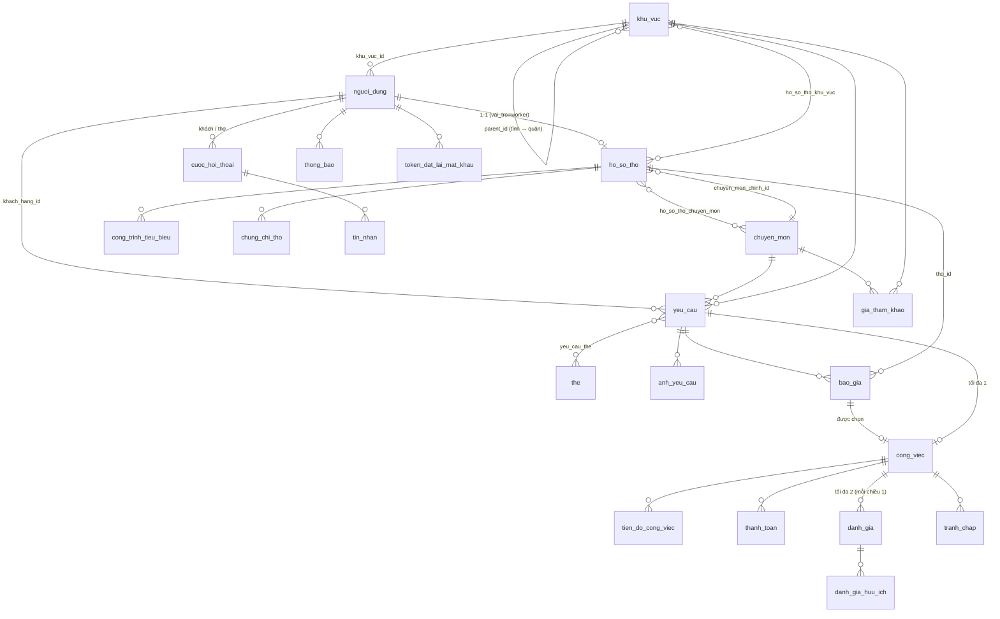

# CSDL — Xây Dựng Kết Nối

MySQL 8.0.16+ · utf8mb4 · InnoDB · 24 bảng · 2 view · 1 procedure · 12 trigger
File tạo: `database/schema.sql`

## 1. Sơ đồ quan hệ (ERD)

Chuỗi nghiệp vụ chính:
`nguoi_dung(customer)` → `yeu_cau` → `bao_gia` (thợ bấm "Nhận việc") → `cong_viec` (khách chọn báo giá) → `tien_do_cong_viec` + `thanh_toan` → `hoan_tat` → `danh_gia` 2 chiều.

## 2. Từ điển dữ liệu

Quy ước chung: khóa chính `INT UNSIGNED AUTO_INCREMENT` (bảng nhiều dòng như `tin_nhan`, `thong_bao` dùng `BIGINT`); tiền `DECIMAL(12,0)` (VND, không lẻ); thời gian `TIMESTAMP`/`DATETIME`; cờ `TINYINT(1)`.

### Danh mục
| Bảng | Cột chính | Ghi chú |
|---|---|---|
| `khu_vuc` | id, ten VARCHAR(100), cap ENUM(tinh_thanh,quan_huyen), parent_id → khu_vuc.id | UNIQUE(parent_id, ten). Trang khách hàng nhập "tỉnh thành", trang thợ nhập "quận" → dùng chung 1 bảng 2 cấp |
| `chuyen_mon` | id, ten UNIQUE, mo_ta, thu_tu, dang_hoat_dong | 8 loại công việc lấy từ dropdown |
| `the` | id, ten UNIQUE | Nhãn "Tường", "Khẩn cấp"... |
| `gia_tham_khao` | chuyen_mon_id, khu_vuc_id, don_vi, gia_min, gia_max | UNIQUE(chuyen_mon, khu_vuc, don_vi) |

### Người dùng & thợ
| Bảng | Cột chính | Ràng buộc |
|---|---|---|
| `nguoi_dung` | ten, sdt VARCHAR(10), email VARCHAR(150), mat_khau_hash VARCHAR(255), vai_tro ENUM(customer,worker,admin), khu_vuc_id → khu_vuc, avatar_url, trang_thai ENUM(hoat_dong,khoa), email_da_xac_thuc, sdt_da_xac_thuc, dang_nhap_cuoi_luc | UNIQUE sdt, UNIQUE email, CHECK sdt REGEXP `^0[0-9]{9}$` |
| `ho_so_tho` | **nguoi_dung_id (PK + FK, 1-1)**, chuc_danh, chuyen_mon_chinh_id, gioi_thieu TEXT, so_nam_kinh_nghiem, hinh_thuc_lam_viec ENUM(toan_thoi_gian,ban_thoi_gian,du_an_theo_goi,linh_hoat), gio_lam_viec, gia_tu, gia_den, don_vi_gia ENUM(ngay,gio), dang_nhan_viec, ban_kinh_nhan_viec_km, da_xac_minh, **so_du_an_hoan_thanh, diem_trung_binh, so_danh_gia, ty_le_phan_hoi** | CHECK gia_den ≥ gia_tu; 4 cột đậm do trigger cập nhật |
| `ho_so_tho_chuyen_mon` | PK(tho_id, chuyen_mon_id) | N-N |
| `ho_so_tho_khu_vuc` | PK(tho_id, khu_vuc_id) | N-N (khu vực phục vụ) |
| `cong_trinh_tieu_bieu` | tho_id, tieu_de, mo_ta, anh_url, ngay_hoan_thanh | Portfolio |
| `chung_chi_tho` | tho_id, ten_chung_chi, don_vi_cap, nam_cap, anh_url | |

### Yêu cầu & báo giá
| Bảng | Cột chính | Ràng buộc |
|---|---|---|
| `yeu_cau` | khach_hang_id, tieu_de VARCHAR(200), chuyen_mon_id, mo_ta TEXT, khu_vuc_id, dia_chi_chi_tiet, ngan_sach_tu/den, so_ngay_mong_muon, han_hoan_thanh DATE, muc_do ENUM(binh_thuong,can_gap), trang_thai ENUM(dang_mo,da_chot,dang_thuc_hien,hoan_thanh,da_huy,het_han) | CHECK ngan_sach_den ≥ tu; FULLTEXT(tieu_de, mo_ta); INDEX(trang_thai, khu_vuc_id, chuyen_mon_id, created_at) |
| `yeu_cau_the` | PK(yeu_cau_id, the_id) | N-N |
| `anh_yeu_cau` | yeu_cau_id, url, thu_tu | |
| `bao_gia` | yeu_cau_id, tho_id, so_tien, mo_ta, so_ngay_thuc_hien, ngay_bat_dau_de_xuat, trang_thai ENUM(cho_khach,duoc_chon,bi_tu_choi,da_rut) | **UNIQUE(yeu_cau_id, tho_id)**, CHECK so_tien > 0 |

### Công việc, tiến độ, thanh toán
| Bảng | Cột chính | Ràng buộc |
|---|---|---|
| `cong_viec` | yeu_cau_id, bao_gia_id, khach_hang_id, tho_id, gia_chot, ngay_bat_dau, ngay_du_kien_xong, ngay_hoan_thanh, trang_thai ENUM(cho_xac_nhan,dang_thuc_hien,hoan_tat,da_huy,tranh_chap), ly_do_huy | **UNIQUE(yeu_cau_id)**, **UNIQUE(bao_gia_id)**, CHECK khach ≠ tho, gia_chot > 0 |
| `tien_do_cong_viec` | cong_viec_id, nguoi_cap_nhat_id, noi_dung, phan_tram, anh_url | CHECK 0–100 |
| `thanh_toan` | cong_viec_id, dot, ten_dot, so_tien, phuong_thuc, trang_thai ENUM(cho_thanh_toan,da_thanh_toan,hoan_tien,that_bai), ma_giao_dich, thanh_toan_luc | UNIQUE(cong_viec_id, dot) |

### Chat, thông báo, đánh giá, tranh chấp, bảo mật
| Bảng | Cột chính | Ràng buộc |
|---|---|---|
| `cuoc_hoi_thoai` | yeu_cau_id, khach_hang_id, tho_id | UNIQUE(khach_hang_id, tho_id, yeu_cau_id) |
| `tin_nhan` | cuoc_hoi_thoai_id, nguoi_gui_id, loai, noi_dung, tep_url, da_doc | INDEX(cuoc_hoi_thoai_id, id) |
| `thong_bao` | nguoi_dung_id, loai, tieu_de, noi_dung, lien_ket, da_doc | INDEX(nguoi_dung_id, da_doc, id) |
| `danh_gia` | cong_viec_id, nguoi_danh_gia_id, nguoi_duoc_danh_gia_id, so_sao TINYINT, noi_dung, huu_ich_count, phan_hoi, phan_hoi_luc, da_cam_on | **UNIQUE(cong_viec_id, nguoi_danh_gia_id)**, CHECK so_sao 1–5, CHECK người đánh giá ≠ người được đánh giá |
| `danh_gia_huu_ich` | PK(danh_gia_id, nguoi_dung_id) | Mỗi người 👍 một lần |
| `tranh_chap` | cong_viec_id, nguoi_tao_id, ly_do, trang_thai ENUM(moi,dang_xu_ly,da_giai_quyet,tu_choi), ket_qua, admin_xu_ly_id | |
| `token_dat_lai_mat_khau` | nguoi_dung_id, token_hash CHAR(64), het_han_luc, da_dung | UNIQUE token_hash (lưu SHA-256, không lưu token gốc) |

## 3. Quy tắc nghiệp vụ được CSDL bảo vệ

| Quy tắc | Cơ chế |
|---|---|
| Chỉ tài khoản `worker` có hồ sơ thợ | trigger `trg_ho_so_tho_bi` |
| Chỉ `customer` đặt yêu cầu | trigger `trg_yeu_cau_bi` |
| Chỉ báo giá cho yêu cầu `dang_mo`; mỗi thợ 1 báo giá / yêu cầu | trigger `trg_bao_gia_bi` + UNIQUE |
| Mỗi yêu cầu chỉ có 1 công việc; mỗi báo giá chỉ thành 1 công việc | UNIQUE trên `cong_viec` |
| Chốt công việc → yêu cầu tự sang `da_chot`; công việc đổi trạng thái → yêu cầu đồng bộ | `trg_cong_viec_ai/au` |
| Hoàn tất → tự ghi `ngay_hoan_thanh`, cập nhật `so_du_an_hoan_thanh` của thợ | `trg_cong_viec_bu/au` |
| Chỉ đánh giá khi công việc `hoan_tat` và đúng 2 bên tham gia | `trg_danh_gia_bi` |
| Điểm TB / số đánh giá của thợ luôn khớp | procedure `sp_cap_nhat_diem_tho` + 3 trigger |
| 👍 đếm đúng, không trùng | `danh_gia_huu_ich` + trigger |

Đã kiểm thử trên MariaDB 10.11: tạo schema, luồng yêu cầu → báo giá → công việc → hoàn tất → đánh giá, và các trường hợp bị chặn (đánh giá sớm, khách có hồ sơ thợ, SĐT sai, báo giá trùng). Nên chạy lại trên MySQL 8 của bạn để chắc chắn.

## 4. Quy tắc phải làm ở tầng Service (CSDL không tự làm được)

1. **Chọn báo giá** — dùng transaction: `bao_gia` được chọn → `duoc_chon`, các báo giá còn lại của yêu cầu → `bi_tu_choi`, tạo `cong_viec`. Dùng `SELECT ... FOR UPDATE` trên `yeu_cau` để 2 khách/2 tab không chốt trùng.
2. Thợ chỉ được báo giá khi `dang_nhan_viec = 1` và thuộc khu vực / chuyên môn phù hợp (hoặc chỉ cảnh báo).
3. Chỉ đúng chủ sở hữu mới sửa/xóa dữ liệu của mình (so `req.user.id` với `khach_hang_id` / `tho_id`).
4. Chuyển trạng thái `cong_viec` theo đồ thị hợp lệ:
   `cho_xac_nhan → dang_thuc_hien → hoan_tat`; hủy được từ `cho_xac_nhan/dang_thuc_hien`; `tranh_chap` từ `dang_thuc_hien/hoan_tat`.
   - Thợ: xác nhận (`cho_xac_nhan → dang_thuc_hien`), cập nhật tiến độ.
   - Khách: nghiệm thu (`→ hoan_tat`), hủy.
5. Cron/job: `yeu_cau` quá `han_hoan_thanh` mà vẫn `dang_mo` → `het_han`; tính lại `ty_le_phan_hoi`.
6. Tổng `thanh_toan.so_tien` không vượt `cong_viec.gia_chot`.
7. Tạo `thong_bao` khi: có yêu cầu mới phù hợp, có báo giá mới, báo giá được chọn, tiến độ cập nhật, có đánh giá mới.

## 5. Trang giao diện ↔ bảng dữ liệu

| Trang | Đọc | Ghi |
|---|---|---|
| `register.html` | khu_vuc | nguoi_dung |
| `dangnhap.html` | nguoi_dung | nguoi_dung.dang_nhap_cuoi_luc, token_dat_lai_mat_khau |
| `customer.html` (form đặt nhu cầu) | khu_vuc, chuyen_mon | yeu_cau, yeu_cau_the, anh_yeu_cau |
| `worker.html` (tạo hồ sơ) | khu_vuc, chuyen_mon | ho_so_tho, ho_so_tho_chuyen_mon, ho_so_tho_khu_vuc |
| `skilled-worker.html` | v_yeu_cau_dang_mo, ho_so_tho, cong_viec | bao_gia (nút Nhận việc), cong_viec (xác nhận) |
| `worker-profile.html` | ho_so_tho + nguoi_dung + danh_gia | — |
| `my-reviews.html` | danh_gia, v_thong_ke_sao_tho | danh_gia.phan_hoi, da_cam_on; danh_gia_huu_ich |
| `index.html` | (tĩnh) | — |

## 6. Việc cần sửa ở giao diện hiện tại

- `customer.html`: "Khu vực" đang là ô nhập chữ → đổi thành `<select>` nạp từ `/khu-vuc`; "Ngân sách" và "Thời gian mong muốn" đang là chữ tự do → tách thành 2 ô số (`ngan_sach_tu`, `ngan_sach_den`) và số ngày. Họ tên, SĐT lấy từ tài khoản đang đăng nhập nên bỏ khỏi form. Thêm ô "Tiêu đề". Trang này cũng có 1 thẻ `</select>` thừa và `</body></html>` bị lặp.
- `worker.html`: khu vực đang có "Khác" và tên tỉnh cố định → nạp từ `/khu-vuc`; chuyên môn nạp từ `/chuyen-mon`; "Giá tham khảo" là chữ → tách `gia_tu`, `gia_den`.
- `worker-profile.html`, `skilled-worker.html`, `my-reviews.html`: dữ liệu đang cứng trong HTML/JS → đổi sang gọi API.
- Trang thợ cần chặn truy cập nếu chưa đăng nhập hoặc sai vai trò (đọc token, gọi `/auth/me`).
- Nút "Đăng xuất" cần xóa token (`API.logout()`).
- Đăng ký xong `register.html` chuyển thợ sang `worker.html`, đăng nhập lại chuyển sang `skilled-worker.html`. Nên thống nhất: thợ chưa có hồ sơ → `worker.html`, đã có hồ sơ → `skilled-worker.html`.

## 7. Danh sách module / API để hoàn thành dự án

| Module | API | Trạng thái |
|---|---|---|
| auth | POST /auth/register, /auth/login; GET /auth/me; POST /auth/forgot-password, /auth/reset-password | register, login đã có |
| khu-vuc | GET /khu-vuc | đã có |
| chuyen-mon | GET /chuyen-mon | cần làm |
| ho-so-tho | GET /tho (lọc: khu vực, chuyên môn, sắp xếp điểm), GET /tho/:id, GET/PUT /tho/me, POST/DELETE /tho/me/cong-trinh | cần làm |
| yeu-cau | POST /yeu-cau, GET /yeu-cau/cua-toi, GET /yeu-cau (thợ xem, lọc), GET /yeu-cau/:id, PATCH /yeu-cau/:id/huy | cần làm |
| bao-gia | POST /yeu-cau/:id/bao-gia, GET /yeu-cau/:id/bao-gia, POST /bao-gia/:id/chon, PATCH /bao-gia/:id/rut | cần làm |
| cong-viec | GET /cong-viec/cua-toi, PATCH /cong-viec/:id/trang-thai, POST/GET /cong-viec/:id/tien-do | cần làm |
| thanh-toan | POST/GET /cong-viec/:id/thanh-toan, PATCH xác nhận | cần làm |
| danh-gia | POST /cong-viec/:id/danh-gia, GET /tho/:id/danh-gia, GET /danh-gia/cua-toi, POST /danh-gia/:id/tra-loi, /cam-on, /huu-ich | cần làm |
| chat | GET /hoi-thoai, GET/POST /hoi-thoai/:id/tin-nhan | cần làm |
| thong-bao | GET /thong-bao, PATCH /thong-bao/:id/da-doc | cần làm |
| tranh-chap / admin | POST /cong-viec/:id/tranh-chap; admin: khóa tài khoản, xử lý tranh chấp | cần làm |
| upload | POST /upload (multer) → ảnh yêu cầu, công trình, avatar | cần làm |

### Điều kiện hoàn thành (checklist)
- [ ] Chạy `schema.sql` không lỗi trên MySQL 8, đủ 24 bảng.
- [ ] Đăng ký / đăng nhập / phân quyền theo vai trò (customer, worker, admin) hoạt động; API bảo vệ bằng `requireAuth`.
- [ ] Thợ tạo và sửa được hồ sơ; khách xem danh sách + chi tiết thợ từ dữ liệu thật.
- [ ] Khách đăng yêu cầu; thợ thấy yêu cầu đúng khu vực và chuyên môn, gửi được báo giá.
- [ ] Khách so sánh báo giá và chọn 1 → tạo công việc, các báo giá khác bị từ chối (transaction).
- [ ] Thợ xác nhận, cập nhật tiến độ; khách nghiệm thu → `hoan_tat`.
- [ ] Đánh giá hai chiều chỉ sau khi hoàn tất; điểm TB của thợ tự cập nhật; thợ trả lời được đánh giá.
- [ ] Chat và thông báo cơ bản; thanh toán ghi nhận theo giai đoạn.
- [ ] Toàn bộ 8 trang giao diện gọi API thật, không còn dữ liệu cứng.
- [ ] Mật khẩu bcrypt, JWT có hạn, `.env` không đưa lên Git, mọi truy vấn dùng tham số `?` (chống SQL Injection), giới hạn kích thước và loại file upload.

## 8. Tài khoản MySQL & kết nối Workbench
Xem `database/tao_tai_khoan_mysql.sql` và `.env.example`.
- `xdkn_app`: tài khoản của Node.js (SELECT, INSERT, UPDATE, DELETE, EXECUTE).
- `xdkn_dev`: tài khoản của bạn trong Workbench (toàn quyền trên database `xay_dung_ket_noi`).
- Tài khoản admin của website: `node scripts/tao-admin.js <email> <sdt> "<mật khẩu>"`.
